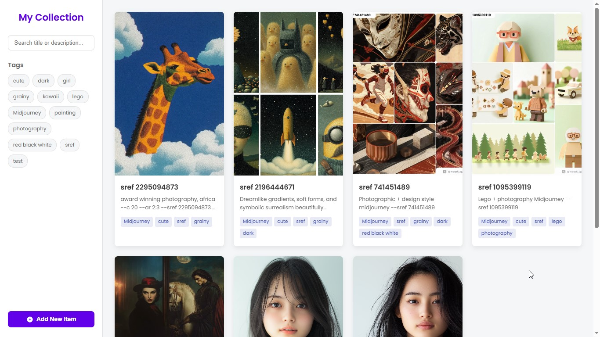

# Image Collection Web App (Flat-File Backend)

A modern, responsive web application for managing a personal image collection. It features image uploads, title/description/tag editing, search, tag filtering, and a clean user interface with animations. Data (metadata and image files) is stored directly on the server using a flat-file approach (JSON for metadata, files for images). Maybe suitable for Midjourney --sref collections.

<!-- Add a GIF or screenshot here -->

<!--  -->



## Features

* **Add New Items:** Upload images, add titles, descriptions, and comma-separated tags.
* **Image Preview:** 2:3 aspect ratio preview in the grid and modal.
* **Edit Items:** Modify the title, description, tags, or replace the image of existing items.
* **Delete Items:** Remove items from the collection (also deletes the associated image file from the server).
* **Responsive Design:** Adapts to various screen sizes (desktop, tablet, mobile).
* **Modern UI:** Clean interface with smooth CSS transitions and animations.
* **Search:** Filter items instantly by title or description (client-side).
* **Tag Filtering:** Filter items by selecting one or more tags from the sidebar list (client-side).
* **Flat-File Storage:** Uses a Node.js/Express backend to:
  * Store item metadata (ID, title, description, tags, image path) in a `data.json` file.
  * Store uploaded image files in an `/uploads` directory.
* **No Database Required:** Relies solely on the server's file system.

## Tech Stack

* **Frontend:**
  * HTML5
  * CSS3 (CSS Variables, Grid, Flexbox, Animations)
  * Vanilla JavaScript (ES6+) (`fetch` API for backend communication)
* **Backend:**
  * Node.js
  * Express.js (Web Framework)
  * `multer` (Middleware for handling `multipart/form-data`, used for file uploads)
  * `cors` (Middleware for enabling Cross-Origin Resource Sharing)
* **"Database":**
  * JSON file (`data.json`) for metadata.
  * Server file system for image storage (`/public/uploads/`).

## Prerequisites

Before you begin, ensure you have the following installed on your system:

* **Node.js:** Version 16.x or later recommended (includes npm). Download from [nodejs.org](https://nodejs.org/).
* **npm:** Node Package Manager (comes bundled with Node.js).
* **Git:** For cloning the repository.

## Installation

1. **Clone the Repository:**
   
   ```bash
   git clone https://github.com/dotslashgabut/image-collection-web-app.git
   cd image-collection-web-app
   ```
   
   **Install Backend Dependencies:**
   Navigate to the project's root directory (where `server.js` and `package.json` are located) in your terminal and run:

2. ```bash
   npm install
   ```
   
   This command reads the `package.json` file and installs the necessary Node.js packages (Express, Multer, CORS).

## Running the Application

1. **Start the Backend Server:**
   From the project's root directory, run:
   
   ```bash
   node server.js
   ```
   
   * You should see output indicating the server is running, typically on `http://localhost:3000`.
   * The server will automatically create the `public/uploads/` directory if it doesn't exist.
   * It will read from/write to `data.json`.

2. **Access the Application:**
   Open your web browser and navigate to the address where the server is running:
   [http://localhost:3000](http://localhost:3000)
   
   You should now see the Image Collection interface and be able to add, edit, and view items.

## API Endpoints (Defined in `server.js`)

The frontend interacts with the backend via these endpoints:

* `GET /api/items`: Retrieves a list of all image items.
* `POST /api/items`: Adds a new image item. Expects `multipart/form-data` with fields: `title`, `description`, `tags` (comma-separated string), and the image file attached as `itemImage`.
* `PUT /api/items/:id`: Updates an existing image item by its `id`. Expects `multipart/form-data`. Can include `title`, `description`, `tags`, and optionally a new `itemImage` file to replace the existing one.
* `DELETE /api/items/:id`: Deletes an image item by its `id` and removes its associated image file.
* `GET /`: Serves the main `index.html` frontend application.
* Static Files: Serves files from the `/public` directory (CSS, JS, and images from `/public/uploads`).

## Limitations

* **No User Authentication:** The collection is accessible to anyone who can reach the server.
* **Basic Error Handling:** Error handling is basic; could be improved for production use.
* **Scalability:** Performance might degrade with a very large number of items due to reading/writing the entire `data.json` file on each modification. Consider a more robust flat-file solution or a database (like SQLite) for huge collections.
* **No Image Optimization:** Images are stored as uploaded; no resizing or optimization is performed.
* **Potential Concurrency Issues:** Directly writing to a single JSON file might lead to race conditions if multiple users were modifying data simultaneously (less likely for personal use).

## License

This project is licensed under the MIT License.

Code generated using Gemini 2.5 Pro Experimental 03-25.